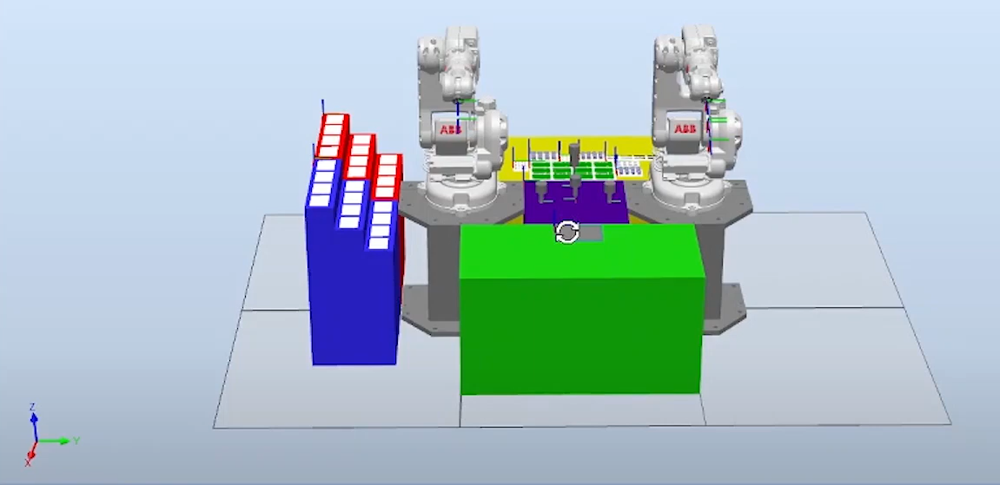

# Making RPI4 with 2xABB IRB140 robots
## Description of system operation
It is a robotic cell for automated soldering of electrical components and checking of electrical connections. The station consists of industrial
robots (two IRB140) with tools to perform the task, a work table with a heating surface, storage of electrical components and blank PCBs, as well
as an output storage for the finished product and a storage for scrap. A sketch of the station is shown in the picture.

## A sketch of the station

### Zero phase of the process:
At the beginning of the program, a message is printed on the FlexPendant screen asking the technician to define the number of required products, and he is offered a numeric keyboard for input. The technician enters a number from 1 to 12, which defines how many repetitions the robot needs to perform. A correct entry is understood if the technician has entered only one digit and then it is in the interval from 1 to 12. If the entry is not adequate, it is necessary to print the appropriate error on the FlexPendant and repeat the entry option until the correct information is entered.

### The first stage of the process:
In the first stage, the robotic arm goes to the tool changer and attaches the tool to transfer the work object to itself. Then, a robotic arm goes to the storage of PCBs with unsoldered components, picks up an empty PCB and places it in front of it.

### Second stage of the process:
Applying solder paste to the places where the components that will be soldered in further steps are placed.

### The third stage of the process:
In this phase, both robot arms go to the electrical component warehouse and pick up the corresponding components in the appropriate manner. When the components are removed from the warehouse, the robot places them on the PCB located on the work table to be soldered using a heating surface. During the operation of the heating surface, it is necessary to turn on a signal that in a real system would turn on a light bulb that would signal its active state.
Note: The robotic arms must operate in synchronous mode at this stage of the process.

### The fourth stage of the process:
After the time required to solder the components of 10s, i.e. when the components are soldered, the robot takes the tool intended for testing electrical connections and checks them.
Once the verification process is complete, a function for a randomly generated number defines whether the soldering was done well. In case the function returns a number 6 or 7 from the set from 0 to 9 - the test is bad, the robot repeats the testing process. In the event that a bad test occurs again after retesting, the product is placed in storage for scrap. In case the test is good - if the function returns a number from the set from 0 to 9, and it is not 6 or 7, the robot continues to work.

### The fifth stage of the process:
When the specified number of products has been placed on the output storage, the technician is asked on the FlexPendant via the TPReadFK procedure whether the process is complete. In case the process is not completed, the program starts from the beginning. If the process is completed, the program ends.

---

### SWITCH AND BUTTONS:
Key I – Both robot arms need to stop in the position they are currently in.

Key II – Both robotic arms are required to continue the path they were previously on (to continue performing the task they started).

Button III - The "main" robot arm needs to move at 10% of the set speed. A second press of the button requires the robot to continue moving at 100% of the set speed.

---

You can watch video models of the elevator at the following link:

https://www.youtube.com/watch?v=k-3DfrVNq5s&ab_channel=MarkoTopalovi%C4%87
